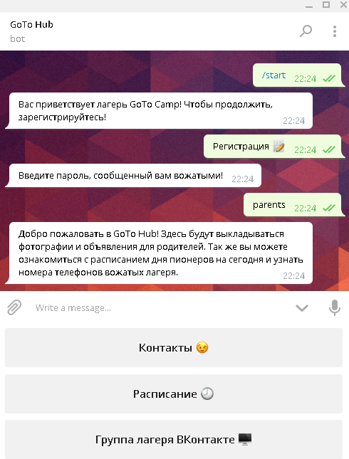
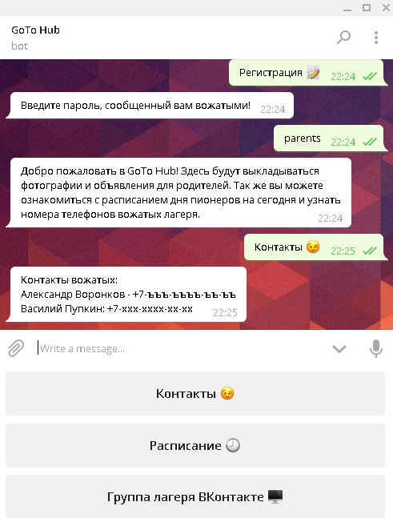
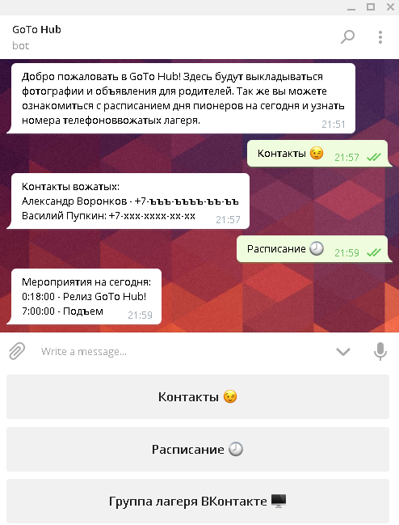
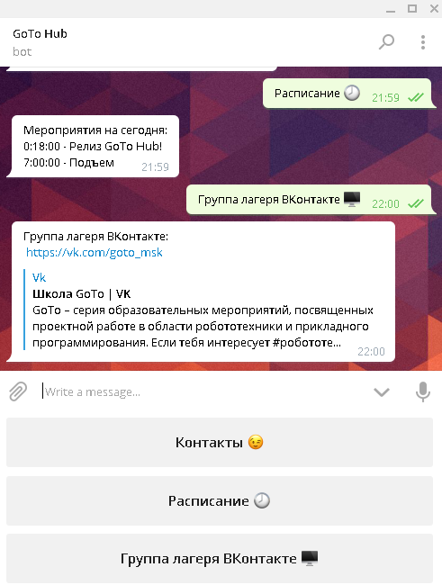

# GoToHub (@gotocamp_bot)

## Telegram чат-бот для лагеря GoTo

### Вход и регистрация
При первом входе пользователю необходимо зарегистрироваться. Чтобы случайные пользователи не заполняли базу данных, в файле config.py можно настроить пароль для входа. Для администрации необходимо ввести администраторский пароль, для простого пользователя - пароль пользователя, имя и фамилию. При последующем использовании бота (даже если бот был предварительно перезагружен) авторизация будет проходить автоматически.

> **Тонкость использования:**  
> Обратите внимание пионеров на то, что необходимо сначла вводить ПОЛНОЕ имя, а затем - фамилию

Кнопка "Регистрация" | Ввод пароля
---------------------|-------------------
 | 

### Администраторская часть

#### Срочное сообщение
Сообщение, введенное администратором, автоматически рассылается всем пользователям GoToHub, прошедшим регистрацию.  

#### Добавление достижений
Администратору необходимо ввести имя получателя достижения и само достижение в формате:  

>*Полное_Имя Фамилия : Достижение*

Пример:

>*Василий Пупкин : Неспящий*

Пионер получит уведомление о получении достижения, а так же оно будет добавлено в общий список достижений пионера.  
Если искоемый пионер отсутсвует или формат ввода некорректен, то бот сообщит об этом. Можно вводить несколько пар значений, начиная каждую пару с новой строки.  
  
#### Создание квеста
Создание квеста происходит в несколько шагов. Сначала, необходимо ввести название (идентификатор) создаваемого квеста.

> **Тонкость использования:**  
> Название квеста должно состоять из одного слова

Затем, необходимо ввести вопросы, на которые будут отвечать команды, а так же ответы на них. Можно вводить как несколько пар в одном сообщении, начиная каждую пару с новой строки, так и каждую пару в отдельном сообщении. Когда все вопросы будут добавлены, введите "Готово!". Формат ввода:

>*Вопрос : Ответ*

Пример:

>*Сколько в одном терапевте гигапевтов? : 1024*

  
Последним этапом является создание ключей команд, по которым будет проходить авторизация. Ключи команд имеют те же ограничения, что и названия квестов, т.е. не должны содержать пробелов.  
  
Когда отряд успешно заканчивает выполнение квеста, всем амдинистраторам приходит уведомление:

>*Команда ОтрядN прошла квест Квест1*

#### Добавление мероприятий
Мероприятие можно добавить, введя его название, а затем - дату, время начала и время конца. Можно вводить сразу несколько мероприятий в одном сообщении, начиная каждое с новой строки. Ввод происходит в формате:  

>*Название и описание : Месяц День Часы_Начала Минуты_Начала Часы_Конца Минуты_Конца*

К примеру, внеплановый второй обед, проходящий с 12:30 до 12:55 будет обозначен так:  

>*Внеплановый Второй Обед : 3 10 12 30 12 55*

При попытке создать несуществующую дату или время (например, 32 марта) бот выдаст ошибку.  
  
#### Добавление контактов
Контакты можно вводить в свободной текстовой форме. Каждый контакт не должен превышать 255 символов. Можно вводить несколько контактов в одном сообщении, начиная каждый с новой строки.  
  
#### Место проживания
В этом разделе можно задать места проживания пионеров. Ввод происходит в формате:  

>*Полное_Имя Фамилия : Место проживания*

При попытке присвоить место проживания незарегестрированному пионеру, бот выдаст ошибку.  
  
### Пользовательская часть

#### Уведомления о срочной рассылке
При срочной рассылке, рассылаемое сообщение приходит всем зарегестрированным пользователям.  

#### Достижения
При получении достижения, пользователь получает уведомление. Так же по команде "Достижения" можно посмотреть список всех полученных достижений.  

#### Уведомления о мероприятиях
Когда начинается мероприятие из расписания, уведомление об этом приходит всем зарегестрированным пользователям. Начавшееся мероприятие переходит в раздел "Что сейчас?" (показывающий активные мероприятия), откуда уходит, когда наступает указанное время конца. По комманде "Расписание" можно посмотреть все мероприятия на день и время их начала.  

#### Прохождение квестов
Сначала, пионерам необходимо ввести название квеста, который они хотят пройти.  
  
Затем, необходимо ввести идентификатор команды.  
  
После этого начнется прохождение квеста! При правильном ответе на вопрос, по нажатию кнопки "Следующий вопрос" будет отправлен следующий вопрос. Если правильный ответ еще не был дан - вновь будет отправлен старый вопрос. Кнопка "Выход" позволяет досрочно выйти из режима квеста.  
  
По окончании прохождения квеста, пользователь будет возвращен в главное меню, а администраторам придет сообщение об удачном прохождении командой квеста.  
  
#### Контакты
Меню контакты разделено на 2 подраздела.  
  
Первый раздел выдает все заполненные вожатыми контакты, второй - место проживания пионера. Если место проживания еще не было заполненно, бот сообщит об этом.

## Установка и настройка
### Python
Для корректной работы бота нужен [Python 3.5.2](https://www.python.org/downloads/).  
Также необходимо установить следующие библиотеки с помощью [pip](https://pythonworld.ru/osnovy/pip.html):  

* pyTelegramBotAPI (если эта библиотека уже была установлена, обновите её, так как последняя версия имеет некоторые различия)
* datetime
* pymysql

### MySQL
Необходимо установить [MySQL Server](https://dev.mysql.com/downloads/mysql/). Во время установки, выберите следующие параметры:  
* Host - localhost
* Port - 3306
* User - root
* Password - password

Когда MySQL установится, запустите MySQL Command Line Client Unicode и выполните следующие команды:

* CREATE DATABASE goto;
* USE goto;
* CREATE TABLE admin(ChatID INT unsigned NOT NULL, Status TINYINT unsigned NULL) ENGINE = InnoDB;
* CREATE TABLE main(ChatID INT unsigned NOT NULL, Name varchar(255) NOT NULL, Home varchar(255) NULL)ENGINE=InnoDB;
* CREATE TABLE contacts(contact varchar(255) NOT NULL) ENGINE=InnoDB;
* CREATE TABLE trophy(ChatID INT unsigned NOT NULL, Achiev varchar(255) NOT NULL) ENGINE=InnoDB;
* CREATE TABLE timetable(Date DATE NOT NULL, Start TIME NOT NULL, Finish TIME NOT NULL, Event varchar(255) NOT NULL, Active TINYINT unsigned NULL DEFAULT 0)ENGINE=InnoDB;

### Настройка бота
Скачайте этот репозиторий и извлеките файлы source и config в отдельную папку. Откройте файл config. В переменную token необходимо вставить токен бота, который дает @BotFather при регистрации бота. В переменные password и admin можно вставить желаемые пароли пользователя и администратора соотвественно. Когда все выше описанное будет сделано, запустите source. Пока этот код запущен, бот будет работать.  

## Обновление 1.2.

>*Легенда гласит, что после этого обновления потом вечно названивающих мам и пап сокращается на 45%*

В данном обновлении в бота был добавлен родительский интерфейс.  
  
### Контакты
Родители могут посмотреть контакты, заполняемые вожатыми через амдинистраторский интерфейс.  
  
### Расписание
Чтобы родителям было проще и удобнее выбрать время для связи с ребенком, им предоставляется расписание мероприятий на текущий день.  

### Группа "ВКонтакте"
Бот отправляет ссылку на группу лагеря Goto ВКонтакте.  

### Расссылка фотографий
Чтобы вожатым было удобнее делиться фотографиями с родителями, при отправке фотографии администраторскому боту, она автоматически будет отправлена всем родителям.  

Администраторская рассылка | Получение родителями
---------------------|-------------------
 | 

### Активация обновления
Так как этой функции не было в конкурсном задании, я решил вынести её в отдельную версию. Чтобы её активировать, выполните все действия для установки обычной версии, если этого еще не было сделано. Затем, выберите branch "Обновление 1.2." и загрузите его. Замените файлы source и config на новые. Настройте config по вашем предпочтениям. Откройте клиент MySQL и пропишите следующую команду:  
* CREATE TABLE parents(ChatID INT unsigned NOT NULL, Status TINYINT unsigned NOT NULL DEFAULT 1)ENGINE=InnoDB;
Поздравляю, обновление активированно!   

Если у вас остались какие то вопросы, связаться со мной можно:  
vk: [Александр Воронков](https://vk.com/pois0n)  
telegram: @diveintodarkness  
Спасибо за просмотр!  
Март 2017
