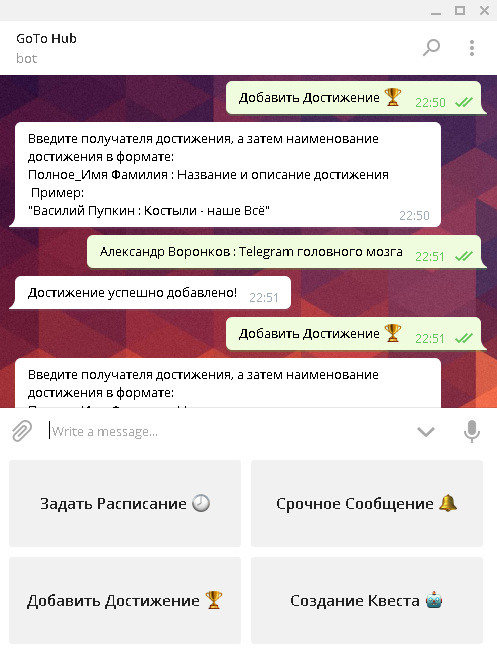
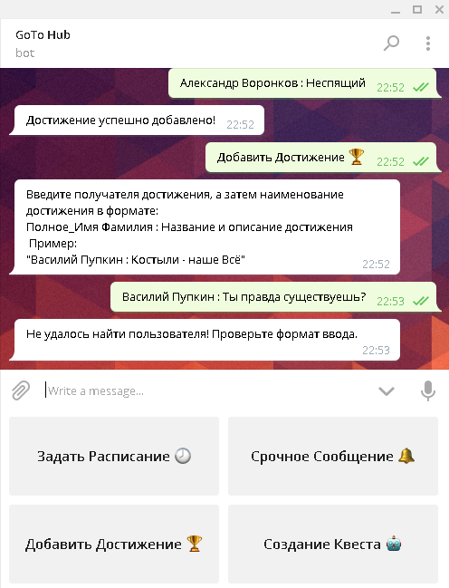

# GoToHub
## Telegram чат-бот для лагеря GoTo
### Вход и регистрация
При первом входе пользователю необходимо зарегестрироваться. Для администрации необходимо ввести администраторский пароль, для простого пользователя - пароль пользователя, имя и фамилию. При последующем использовании бота (даже если бот был предварительно перезагружен) авторизация будет проходить автоматически.

> **Тонкость использования:**  
> Обратите внимание пионеров на то, что необходимо сначла вводить ПОЛНОЕ имя, а затем - фамилию

Кнопка "Регистрация" | Ввод пароля
---------------------|-------------------
 | 

### Администраторская часть

#### Срочное сообщение
Сообщение, введенное администратором, автоматически рассылается всем пользователям GoToHub, прошедшим регистрацию.  

#### Добавление достижений
Администратору необходимо ввести имя получателя достижения и само достижение в формате:  

>*Полное_Имя Фамилия : Достижение*

Пример:

>*Василий Пупкин : Неспящий*

  
Пионер получит уведомление о получении достижения, а так же оно будет добавлено в общий список достижений пионера.  
Если искоемый пионер отсутсвует или формат ввода некорректен, то бот сообщит об этом. 
  
#### Создание квеста
Создание квеста происходит в несколько шагов. Сначала, необходимо ввести название (идентификатор) создаваемого квеста.

> **Тонкость использования:**  
> Название квеста должно состоять из одного слова

*Добавить картиночки*  
Затем, необходимо ввести вопросы, на которые будут отвечать команды, а так же ответы на них. Каждую новую пару вопрос-ответ необходимо отправить в отдельном сообщении. Когда все вопросы будут добавлены, введите "Готово!". Формат ввода:

>*Вопрос : Ответ*

Пример:

>*Сколько в одном терапевте гигапевтов? : 1024*

Последним этапом является создание ключей команд, по которым будет проходить авторизация. Ключи команд имеют те же ограничения, что и названия квестов.
