# GoToHub (@gotocamp_bot)
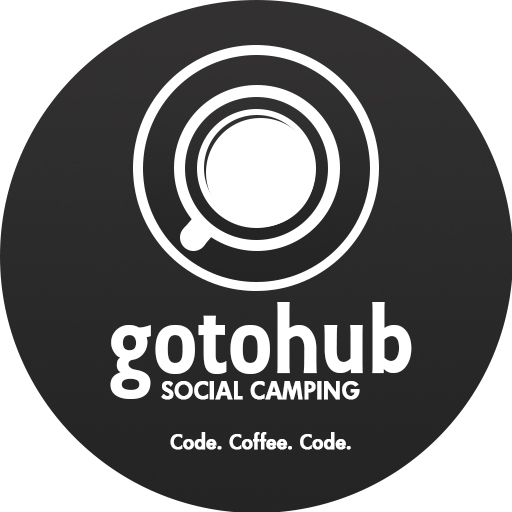
## Telegram чат-бот для лагеря GoTo

### Вход и регистрация
При первом входе пользователю необходимо зарегистрироваться. Чтобы случайные пользователи не заполняли базу данных, в файле config.py можно настроить пароль для входа. Для администрации необходимо ввести администраторский пароль, для простого пользователя - пароль пользователя, имя и фамилию. При последующем использовании бота (даже если бот был предварительно перезагружен) авторизация будет проходить автоматически.

> **Тонкость использования:**  
> Обратите внимание пионеров на то, что необходимо сначла вводить ПОЛНОЕ имя, а затем - фамилию

Кнопка "Регистрация" | Ввод пароля
---------------------|-------------------
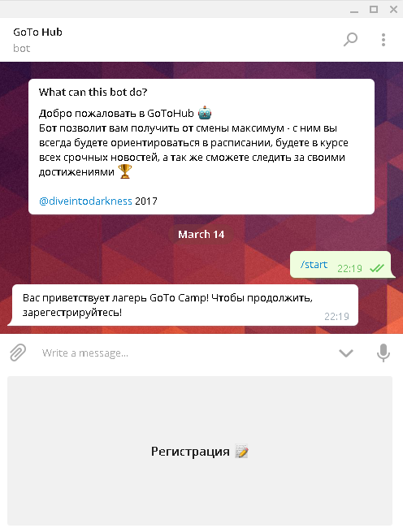 | 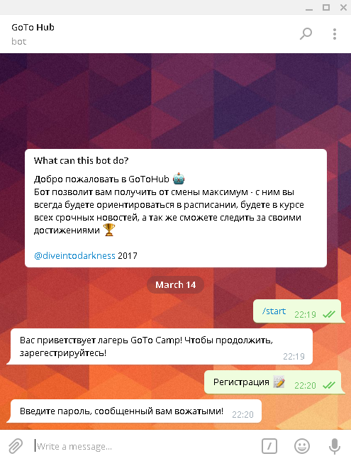

### Администраторская часть
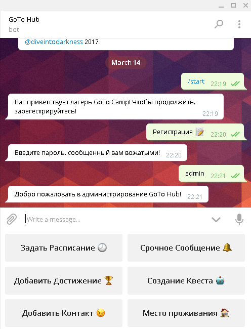
#### Срочное сообщение
Сообщение, введенное администратором, автоматически рассылается всем пользователям GoToHub, прошедшим регистрацию.  
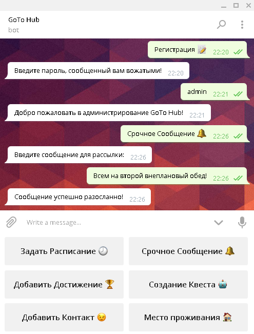
#### Добавление достижений
Администратору необходимо ввести имя получателя достижения и само достижение в формате:  

>*Полное_Имя Фамилия : Достижение*

Пример:

>*Василий Пупкин : Неспящий*

Пионер получит уведомление о получении достижения, а так же оно будет добавлено в общий список достижений пионера.  
Если искоемый пионер отсутсвует или формат ввода некорректен, то бот сообщит об этом. Можно вводить несколько пар значений, начиная каждую пару с новой строки.  
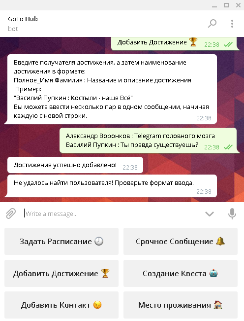  
#### Создание квеста
Создание квеста происходит в несколько шагов. Сначала, необходимо ввести название (идентификатор) создаваемого квеста.

> **Тонкость использования:**  
> Название квеста должно состоять из одного слова

Затем, необходимо ввести вопросы, на которые будут отвечать команды, а так же ответы на них. Можно вводить как несколько пар в одном сообщении, начиная каждую пару с новой строки, так и каждую пару в отдельном сообщении. Когда все вопросы будут добавлены, введите "Готово!". Формат ввода:

>*Вопрос : Ответ*

Пример:

>*Сколько в одном терапевте гигапевтов? : 1024*

  
Последним этапом является создание ключей команд, по которым будет проходить авторизация. Ключи команд имеют те же ограничения, что и названия квестов, т.е. не должны содержать пробелов.  
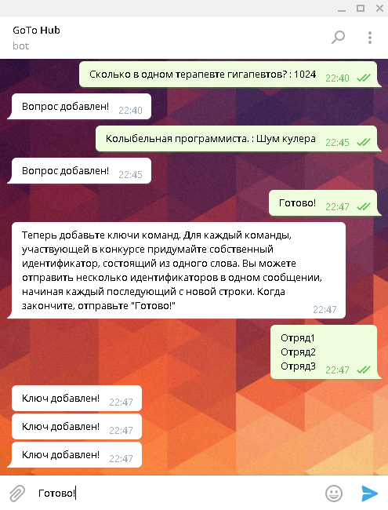  
Когда отряд успешно заканчивает выполнение квеста, всем амдинистраторам приходит уведомление:

>*Команда ОтрядN прошла квест Квест1*

#### Добавление мероприятий
Мероприятие можно добавить, введя его название, а затем - дату, время начала и время конца. Можно вводить сразу несколько мероприятий в одном сообщении, начиная каждое с новой строки. Ввод происходит в формате:  

>*Название и описание : Месяц День Часы_Начала Минуты_Начала Часы_Конца Минуты_Конца*

К примеру, внеплановый второй обед, проходящий с 12:30 до 12:55 будет обозначен так:  

>*Внеплановый Второй Обед : 3 10 12 30 12 55*

При попытке создать несуществующую дату или время (например, 32 марта) бот выдаст ошибку.  
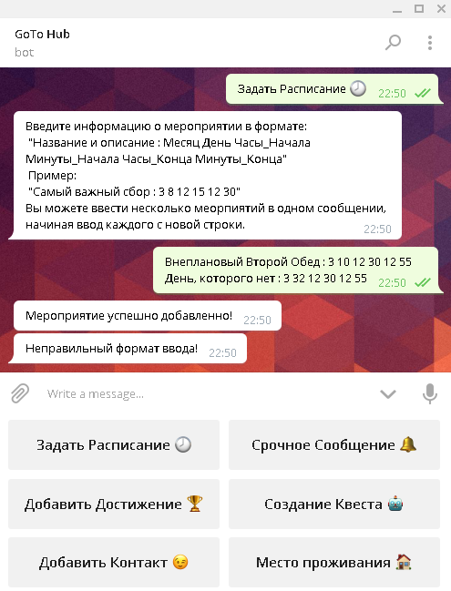  
#### Добавление контактов
Контакты можно вводить в свободной текстовой форме. Каждый контакт не должен превышать 255 символов. Можно вводить несколько контактов в одном сообщении, начиная каждый с новой строки.  
  
#### Место проживания
В этом разделе можно задать места проживания пионеров. Ввод происходит в формате:  

>*Полное_Имя Фамилия : Место проживания*

При попытке присвоить место проживания незарегестрированному пионеру, бот выдаст ошибку.  
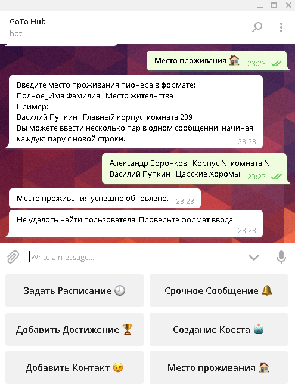  
### Пользовательская часть

#### Уведомления о срочной рассылке
При срочной рассылке, рассылаемое сообщение приходит всем зарегестрированным пользователям.  
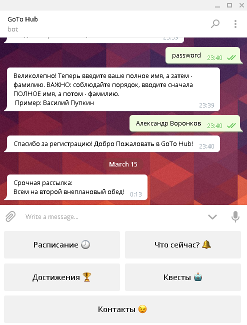
#### Достижения
При получении достижения, пользователь получает уведомление. Так же по команде "Достижения" можно посмотреть список всех полученных достижений.  
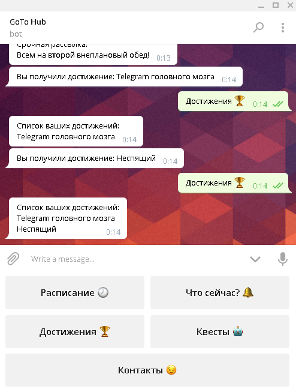
#### Уведомления о мероприятиях
Когда начинается мероприятие из расписания, уведомление об этом приходит всем зарегестрированным пользователям. Начавшееся мероприятие переходит в раздел "Что сейчас?" (показывающий активные мероприятия), откуда уходит, когда наступает указанное время конца. По комманде "Расписание" можно посмотреть все мероприятия на день и время их начала.  
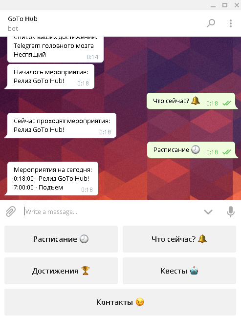
#### Прохождение квестов
Сначала, пионерам необходимо ввести название квеста, который они хотят пройти.  
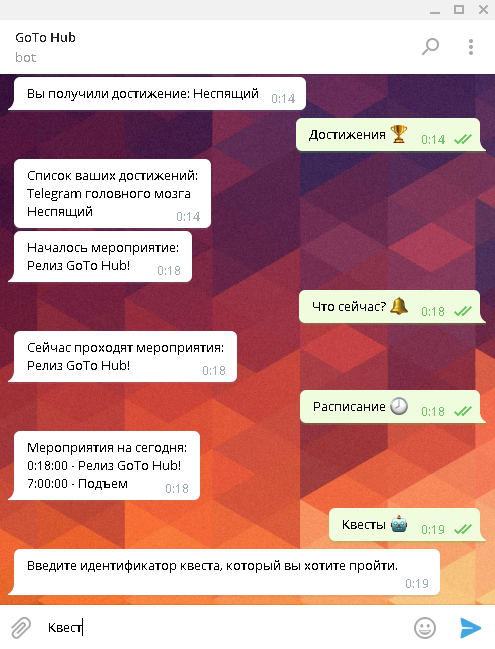  
Затем, необходимо ввести идентификатор команды.
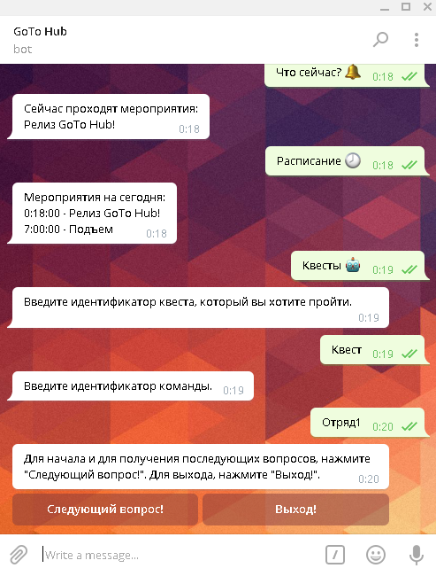  
После этого начнется прохождение квеста! При правильном ответе на вопрос, по нажатию кнопки "Следующий вопрос" отправит следующий вопрос. Если правильный ответ еще не был дан - вновь отправит старый вопрос. Кнопка "Выход" позволяет досрочно выйти из режима квеста.  
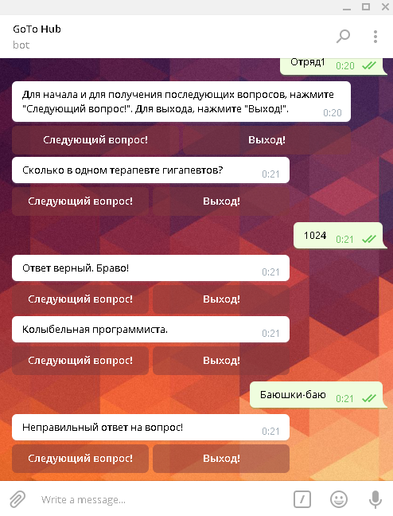  
При окончании прохождения квеста, пользователь будет возвращен в главное меню, а администраторам придет сообщение об удачном прохождении командой квеста.  
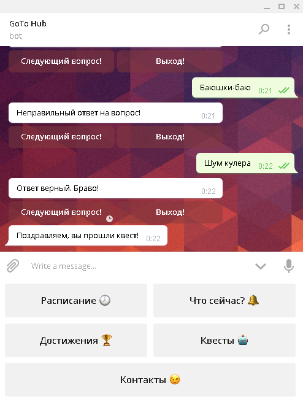  
#### Контакты
Меню контакты разделено на 2 подраздела.  
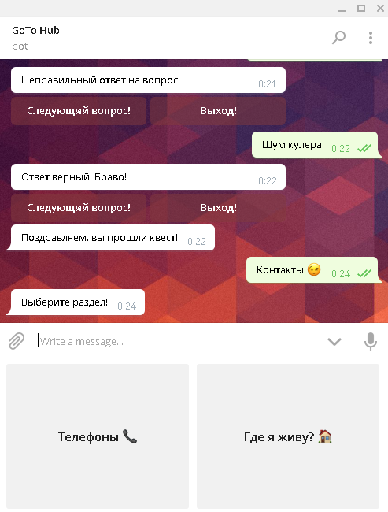  
Первый раздел выдает все заполненные вожатыми контактами, второй - место проживания пионера. Если место проживания еще не было введено, бот сообщит об этом.
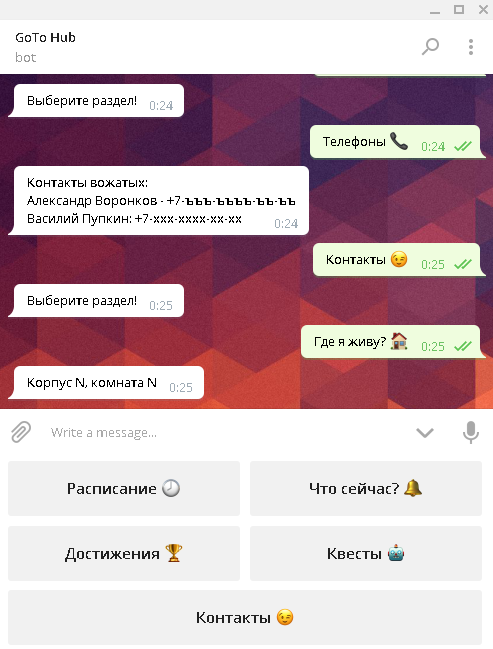 
