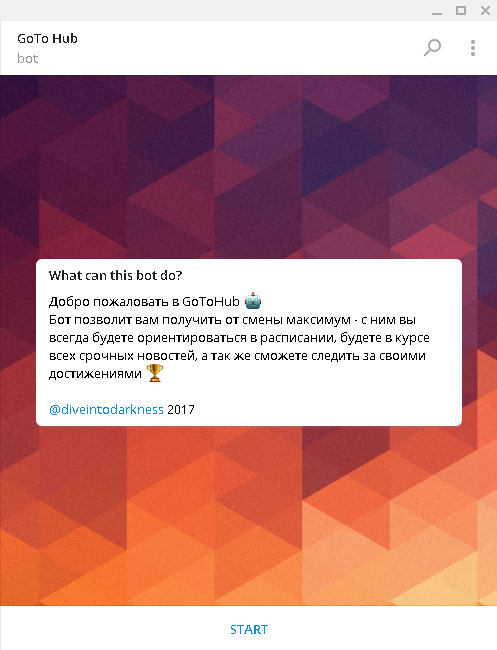
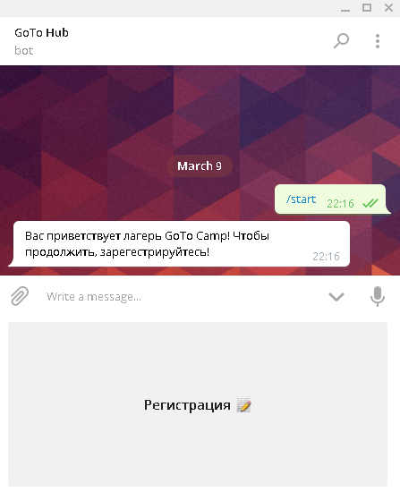
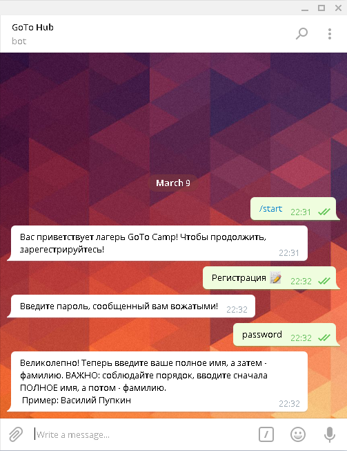
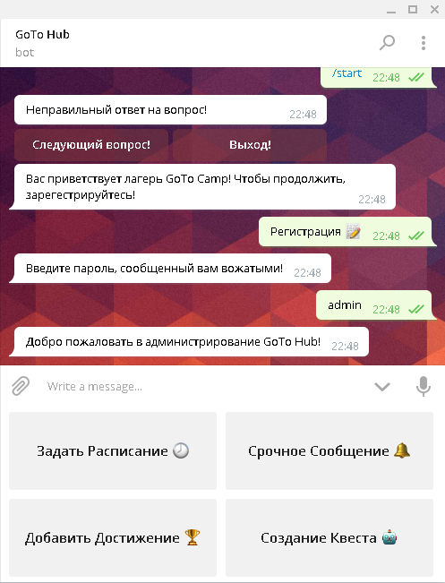
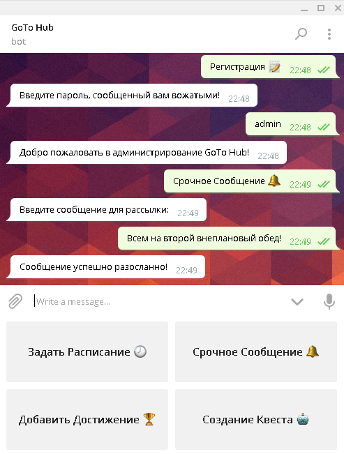
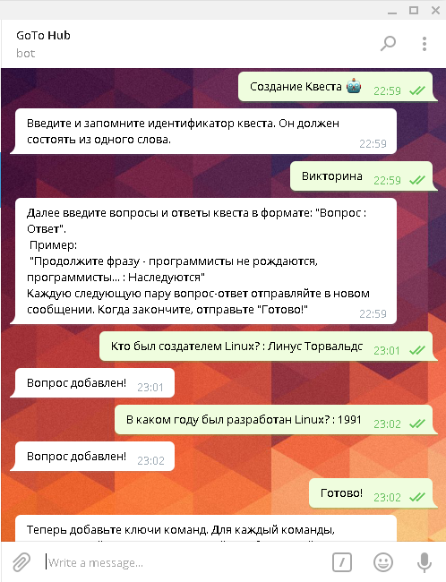
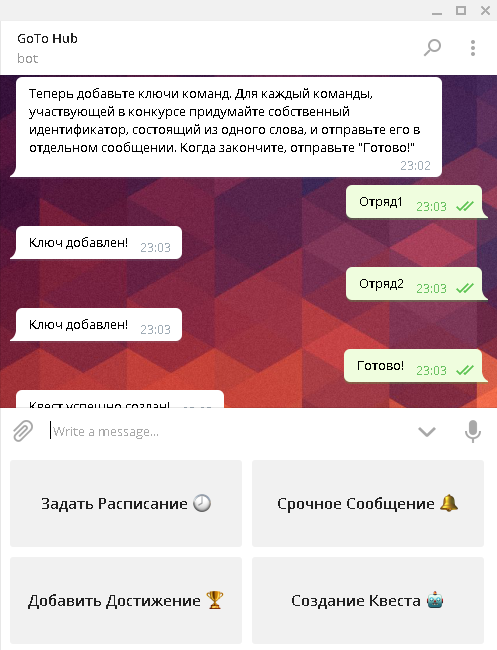
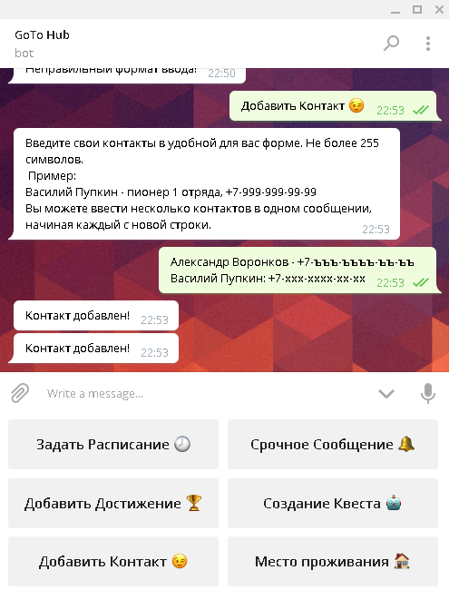
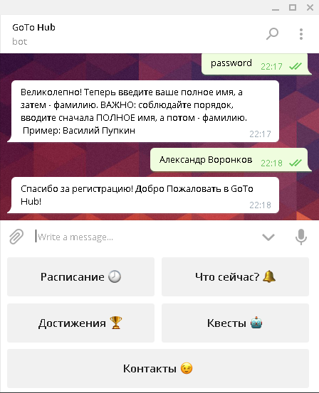
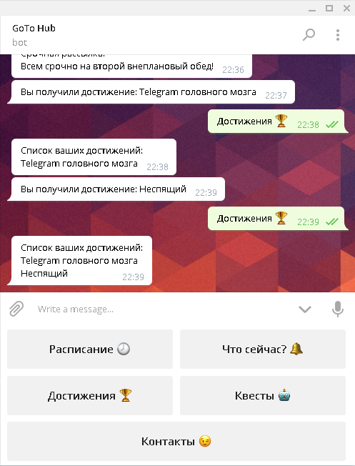

# GoToHub (@gotocamp_bot)
## Telegram чат-бот для лагеря GoTo

### Вход и регистрация
При первом входе пользователю необходимо зарегестрироваться. Чтобы случайные пользователи не заполняли базу данных, в файле config.py можно настроить пароль для входа. Для администрации необходимо ввести администраторский пароль, для простого пользователя - пароль пользователя, имя и фамилию. При последующем использовании бота (даже если бот был предварительно перезагружен) авторизация будет проходить автоматически.

> **Тонкость использования:**  
> Обратите внимание пионеров на то, что необходимо сначла вводить ПОЛНОЕ имя, а затем - фамилию

Кнопка "Регистрация" | Ввод пароля
---------------------|-------------------
 | 

### Администраторская часть

#### Срочное сообщение
Сообщение, введенное администратором, автоматически рассылается всем пользователям GoToHub, прошедшим регистрацию.  

#### Добавление достижений
Администратору необходимо ввести имя получателя достижения и само достижение в формате:  

>*Полное_Имя Фамилия : Достижение*

Пример:

>*Василий Пупкин : Неспящий*

  
Пионер получит уведомление о получении достижения, а так же оно будет добавлено в общий список достижений пионера.  
Если искоемый пионер отсутсвует или формат ввода некорректен, то бот сообщит об этом.  
#### Создание квеста
Создание квеста происходит в несколько шагов. Сначала, необходимо ввести название (идентификатор) создаваемого квеста.

> **Тонкость использования:**  
> Название квеста должно состоять из одного слова

Затем, необходимо ввести вопросы, на которые будут отвечать команды, а так же ответы на них. Можно вводить как несколько пар в одном сообщении, начиная каждую пару с новой строки, так и каждую пару в отдельном сообщении. Когда все вопросы будут добавлены, введите "Готово!". Формат ввода:

>*Вопрос : Ответ*

Пример:

>*Сколько в одном терапевте гигапевтов? : 1024*

  
Последним этапом является создание ключей команд, по которым будет проходить авторизация. Ключи команд имеют те же ограничения, что и названия квестов, т.е. не должны содержать пробелов.  
  
#### Добавление мероприятий
Мероприятие можно добавить, введя его название, а затем - дату, время начала и время конца. Можно вводить сразу несколько мероприятий в одном сообщении, начиная каждое с новой строки. Ввод происходит в формате:  

>*Название и описание : Месяц День Часы_Начала Минуты_Начала Часы_Конца Минуты_Конца*

К примеру, внеплановый второй обед, проходящий с 12:30 до 12:55 будет обозначен так:  

>*Внеплановый Второй Обед : 3 10 12 30 12 55*

При попытке создать несуществующую дату или время (например, 32 марта) бот выдаст ошибку.  
  
#### Добавление контактов
Контакты можно вводить в свободной текстовой форме. Каждый контакт не должен превышать 255 символов. Можно вводить несколько контактов в одном сообщении, начиная каждый с новой строки.  
  
#### Место проживания
В этом разделе можно задать места проживания пионеров. Ввод происходит в формате:  

>*Полное_Имя Фамилия : Место проживания*

При попытке присвоить место проживания незарегестрированному пионеру, бот выдаст ошибку.  
  
### Пользовательская часть

#### Уведомления о срочной рассылке
При срочной рассылке, рассылаемое сообщение приходит всем зарегестрированным пользователям.  

#### Достижения
При получении достижения, пользователь получает уведомление. Так же по команде "Достижения" можно посмотреть список всех полученных достижений.  

